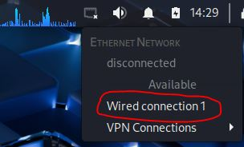
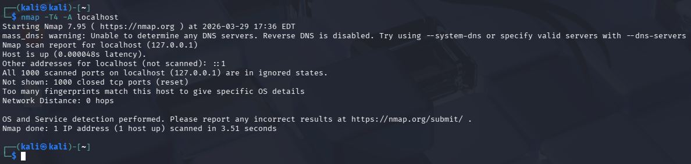
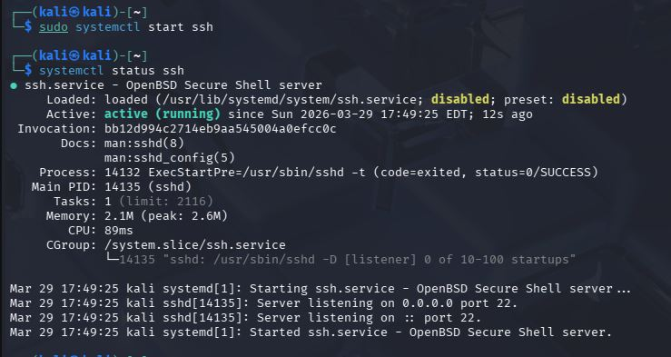
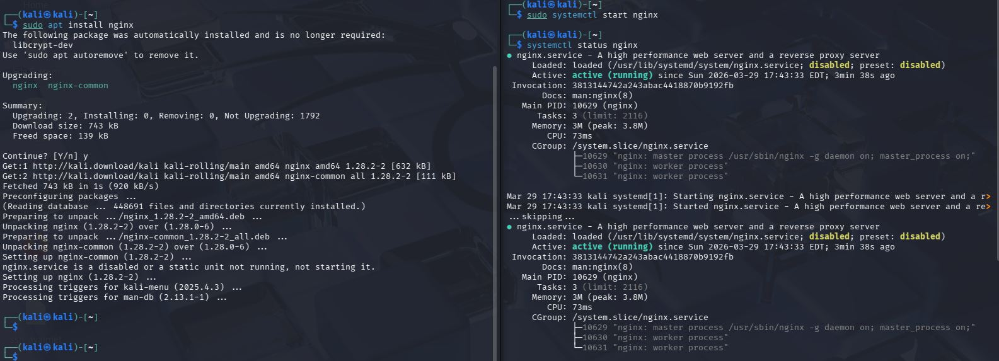
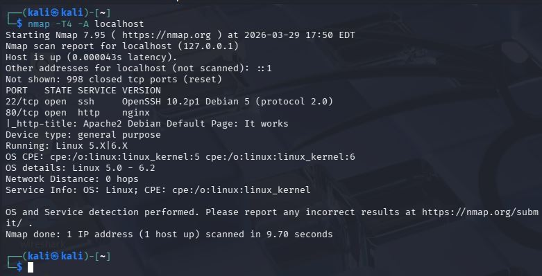
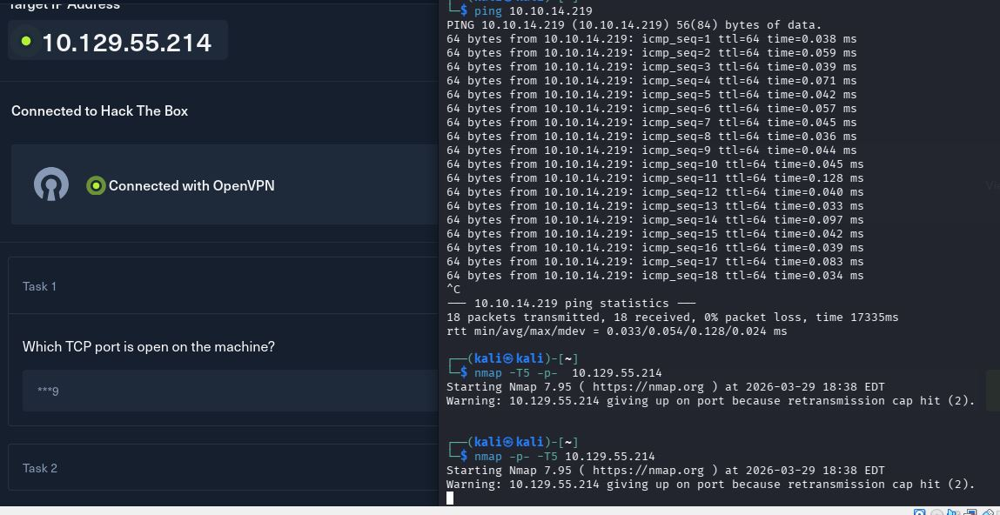
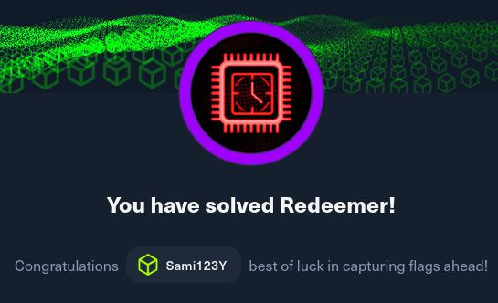

# h1 Kybertappoketju
[Tero Karvinen 2026 late spring: Tunkeutumistestaus, h1 Kybertappoketju](https://terokarvinen.com/tunkeutumistestaus/)

## x)  Lue/katso/kuuntele ja tiivistä.

### Herrasmieshakkerit
[Herrasmieshakkerit Eurooppa Ensin, vieraana europarlamentaarikko Aura Salla | 0x42 Mar 19, 2026](https://herrasmieshakkerit.fi/)
Podcast jakso Mikko Hyppönen ja Tomi Tuominen, vieraana Aura Salla. Aiheena tekoälyä, EU-lainsäädäntöä ja sen sääntelyä, ulko- ja sisäpolitiikkaa EU:ssa. 
- EU-komissio ajaa 2029 mennessä digi-euron markkinoille.
- NPM ollut hyökkäyksen kohteena. Classic tokens korvattu lyhyt-kestoisilla istunto kohtaisilla tokeneilla, jotka vaatii MFA tunnistautumista, tähän lisättynä OICD trusted publishing.
- Shai hulud hyökkäys.

Aura Salla
- Salla puhuu EU-lainsäädännön sääntelystä ja lobbaamisesta sekä kansallisista intresseistä.
- Kannattaa ei eurooppalaisesta teknologiasta irtoamista.

### 3.2 Intrusion Kill Chain
[Hutchins et al 2011: Intelligence-Driven Computer Network Defense Informed by Analysis of Adversary Campaigns and Intrusion Kill Chains: 3.2 Intrusion Kill Chain](https://lockheedmartin.com/content/dam/lockheed-martin/rms/documents/cyber/LM-White-Paper-Intel-Driven-Defense.pdf)

Kyber tappoketju on systemaattinen maalittamisen ja hyökkäämisen prosessi.
Seitsemän tappoketjun vaihetta:
- Reconnaissance, etsitään kohteita ja haavoittuvuuksia.
- Weaponization, hyödynnetään haavoittuvuutta ja/tai luodaan haittaohjelma.
- Delivery, saatetaan haittaohjelma kohteeseen.
- Exploitation, haittaohjelma alkaa toimia kohteessa.
- Installation, ladataan etäkäyttö työkalu kohteeseen tai luodaan takaportti.
- Command and Control, haittaohjelma ja hyökkääjä muodostavat yhteyden.
- Actions on Objectives, hyökkääjä tekee rikoksiaan kohteessa ja/tai käyttää sitä alustana hyökätä muualle samassa verkossa.


### 4.3 Surveying Essential Tools for Active Reconnaissance.
[Santos et al: The Art of Hacking (Video Collection): 4.3 Surveying Essential Tools for Active Reconnaissance.](https://learning.oreilly.com/videos/the-art-of/9780135767849/9780135767849-SPTT_04_00)

Aktiivinen tiedustelu: Porttien skannaus eli avoimien porttien etsiminen, web-sovelluksien tutkailu, haavoittuvuuksien etsiminen.
- NMAP porttiskanneri ja palvelun havaintseminen.
- MASSCAN, nopea porttiskanneri.
- UDP-proto-scanner, UDP protokolla skanneri.
- EyeWitness, web-sovelluksien tutkailu.

### KKO:2003:36
[Korkeimman oikeuden ennakkopäätös, KKO:2003:36](https://www.finlex.fi/fi/oikeuskaytanto/korkein-oikeus/ennakkopaatokset/2003/36)

Osuuspankkiin tehty porttiskannaus oli aiheuttanut pitkän oikeusprosessin. Teko tulkittiin tietomurron yritykseksi ja sen selvittämisestä aiheutuneista kuluista oli vaadittu rahallista korvausta.


## a) Asenna Kali virtuaalikoneeseen

Olen aiemmin ladannut valmiin Kali virtuaalikoneen. Sen käyttöönotto tapahtui helposti VirtualBox sovelluksessa lisäämällä.
- kali-linux-2025.4-virtualbox-amd64
  - Debian (64-bit)
  - 2048 MB base memory
  - 2 vCPU
  - Intel NAT Network adapter
    
  [www.kali.org kali pre-built virtual machines - virtualbox](https://www.kali.org/get-kali/#kali-virtual-machines)

## b) Irrota Kali-virtuaalikone verkosta. Todista testein, että kone ei saa yhteyttä Internetiin



## c) Porttiskannaa 1000 tavallisinta tcp-porttia omasta koneestasi
Komennolla:
```
nmap -T4 -A localhost
```
[nmap Options Summary](https://nmap.org/book/man-briefoptions.html)
```
-T4 nopeuttaa skannausta
```
```
-A Ottaa käyttöön: OS detection, version detection, script scanning, and traceroute
```



Ei yhtäkään porttia auki.

## d) Asenna kaksi vapaavalintaista demonia ja skannaa uudelleen. Analysoi ja selitä erot.
Otan ssh palvelimen ja web-palvelimen tutkailtavaksi.
Minulla on jo openssh, mutta lataan nginx web-palvelimen.

                       

Käynnistin molemmat demonit ja suoritin sen jälkeen uuden skannauksen.



Nyt koneella on kaksi porttia auki, 22 ja 80. Portti 22 on oletus ssh-protokollan portti. Portti 80 on oletus http-protokollan portti.
nmap tunnistaa prosessit OpenSSH ja NGINX.
Nmap jopa huomasi enemmän tietoa käyttöjärjestelmästäni.
```
Os Linux 5.0 - 6.2
```

## e) Ratkaise vapaavalintainen kone HackTheBoxista.

### Redeemer


Yhdistin OpenVPN:llä HTB harjoituskoneelle lataamalla .ovpn tiedoston ja antamalla sen sitten OpenVPN:lle.
```
openvpn ~/Downloads/ovpntiedosto.ovpn
```

Ensiksi minua kiinnostaa avoimet portit. Siispä nmap aukinaisista porteista: 
```
nmap -T5 -p- <ip-osoite>
```
Skannaa kaikki portit parametrillä:
```
-p-
```
Tässä kesti oikeasti kauan, yli 15min.
Kohteessa on redis portissa 6379



Välissä on muutamia kysymyksiä rediksestä ja sen CLI:stä. Kuten mistä näet käyttämäsi version:
```
info
```


Näistä selvisin redis dokumentaatiolla [Redis CLI](https://redis.io/docs/latest/develop/tools/cli/)

Lopussa ongitaan CLI:n kautta lippu esille. valitaan indexi 0 ja sieltä kaikki avaimet. Siellä on yksis avain nimeltä flag. 
```
select 0
```
```
keys *
```
```
get flag
```


## Lähteet
- [Tero Karvinen](https://terokarvinen.com/tunkeutumistestaus/)
- [Herrasmieshakkerit](https://herrasmieshakkerit.fi/)
- [Lockheed-martin](https://lockheedmartin.com/content/dam/lockheed-martin/rms/documents/cyber/LM-White-Paper-Intel-Driven-Defense.pdf)
- [Finlex, korkeinoikeus ennakkopäätökset](https://www.finlex.fi/fi/oikeuskaytanto/korkein-oikeus/ennakkopaatokset/2003/36)
- [Santos et al: The Art of Hacking (Video Collection)](https://learning.oreilly.com/videos/the-art-of/9780135767849/9780135767849-SPTT_04_00)
- [nmap](https://nmap.org/book/man-briefoptions.html)
- [Redis CLI](https://redis.io/docs/latest/develop/tools/cli/)


