# h3 EternalHomework

## x) Lue/katso/kuuntele ja tiivistä. 

[Jaswal 2020: Mastering Metasploit - 4ed: Chapter 1: Approaching a Penetration Test Using Metasploit](https://learning.oreilly.com/library/view/mastering-metasploit/9781838980078/B15076_01_Final_ASB_ePub.xhtml#_idParaDest-31)
- Metasploitable keskeiset käsitteet ja komennot.
- Miksi kannattaa harjoitella tunkeutumistestausta käyttäen metasploitable framework.
- Harjoitus, IP-osoitteen haavoittuvuuksien kartoitus.
  - Tiedon keräys, tiedon taltiointi, uhka mallinnus, haavoittuvuus analyysi, haavoittuvuuden hyödyntäminen, toiminta kohteessa ja tunkeutumisen laajentaminen.

### Mitä 'nmap -sn' tekee? Älä arvaa, vaan perustele lähteillä. Mistä tiedät, että käyttämäsi lähde on luotettava?

- Komento tekee verkkoskannauksen. Parametri "-sn" ottaa portti skannauksen pois käytöstä. Eli palvelimen löydettyään nmap ei skannaa sen portteja. [nmap manual, host discovery](https://nmap.org/book/man-host-discovery.html) 
- Tämän ohjekirjan on kirjoittanut nmap-työkalun kehittäjä, Gordon Lyon "Fyodor". Hän on myös kirjoittanut aiheesta kirjan
Gordon "Fyodor" Lyon, Nmap Network Scanning: The Official Nmap Project Guide to Network Discovery and Security Scanning.
Kirjassa mainitaan sama asia [Kappaleessa 3. Host Discovery (“Ping Scanning”): Disable Port Scan (-sn)](https://nmap.org/book/host-discovery-controls.html#host-discovery-sn)

## b) Tallenna porttiskannauksen tuloksia Metasploitin tietokantoihin. 
Skannaa niin, että Metasploitable tulee mukaan. Kannattaa ottaa mukaan ainakin versioskannaus -sV (joka on banner grabbing plus).

### Ensin nopea alustus. Postgresql tietokanta päälle ja msfconsole auki.
```
sudo msfdb init

sudo msfconsole

sudo db_status
```
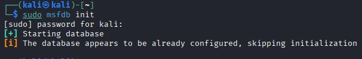


### Sitten aletaanpa skannaamaan.
```
db_nmap -sV 192.168.56.103
```
Parametri -sV eli service version näyttää palveluiden tarkat versiot. Siitä on hyötyä, kun alkaa miettimään miten hyökkää.

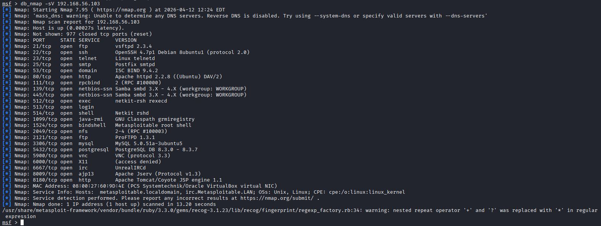


## c) Tarkastele Metasploitin tietokantoihin tallennettuja tietoja komennoilla "hosts" ja "services". Kokeile suodattaa näitä listoja tai hakea niistä.

### Katson ensins mitä tietoja löytyy tallennetuista isännistä. Käyttäen komentoa: hosts.

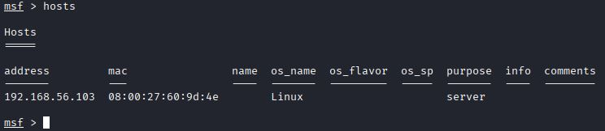

Siellä näkyy kohdekone, joka juuri skannattiin edellisessä tehtävässä käyttäen nmap. IP- ja MAC-osoite sekä käyttöjärjestelmän tyyppi löytyy.

### Katsotaan seuraavaksi mitä palveuilta tallentui tietokantaan. Käytän tässä komentoa: services.

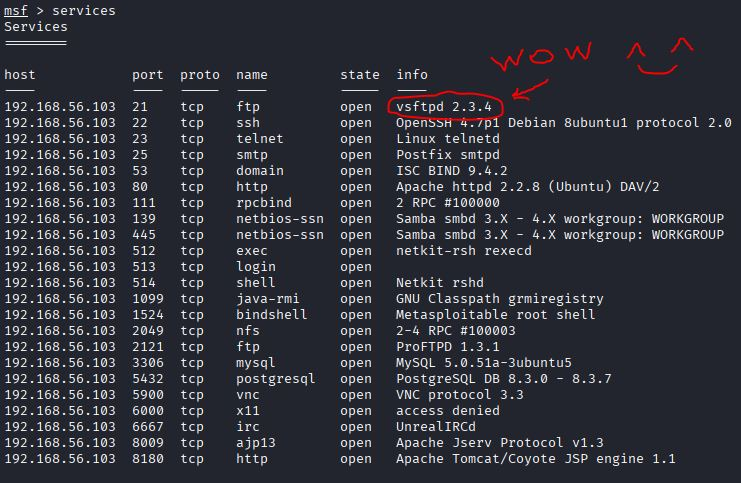

Siellä näkyy kaikki avoimena olleet portit ja kertoopa vielä, mitä palveluita siellä pyörii.

### Rajataan hakua pelkästään näyttämään vain vsftp.
services parametrit saa näkyviin "services -h"

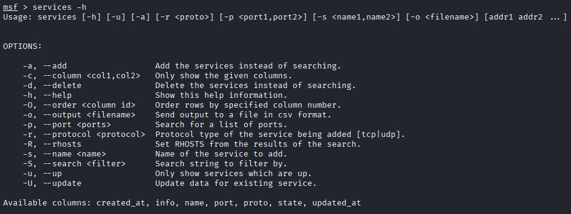

Kokeillaan rajata hakua, search vaihtoehdolla.

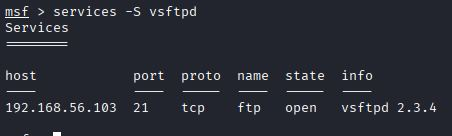

Ja näin!

## d) Internet famous. Etsi Metasploitablen mukana tulevista hyökkäyksistä (en: exploits; search) sellainen, joka on ollut julkisuudessa.

### Valitaan aiemmin löydettyjen avoimien palveluiden listalta ensimmäinen. VSFTPD!
Sille löytyy cve merkintä vuodelta 2011. Vsftpd 2.3.4 Backdoored versio sallii etä-shell yhteyden porttiin 6200. [CVEdetails.com, Updated 2021: Vulnerability Details : CVE-2011-2523](https://www.cvedetails.com/cve/CVE-2011-2523/)

Etsin sille moduulin metasploitablesta. Voin käyttää sitä seuraavissa tehtävissä myös.
Komennolla "search" voidaan etsiä metasploitable moduuleja [OffSec: metasploit unleashed: msfconsole](https://www.offsec.com/metasploit-unleashed/msfconsole/)
```
search vsftpd
```

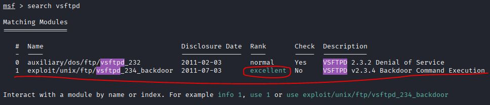

## e) Vertaile nmap:n omaa tiedostoon tallennusta (-oA foo) ja db_nmap:n tallennusta tietokantoihin. 
Mitkä ovat eri tiedostomuotojen ja Metasploitin tietokannan hyvät puolet?

Metasploit tallentaa nmap tulokset postgreSQL tietokantaan.
- Sieltä voi viedä tiedot ulos ja sisään helposti
- Sallii nopean pääsyn skannaus tuloksiin.
  [OffSec: metasploit unleashed: Databases](https://www.offsec.com/metasploit-unleashed/database-introduction/)

Nmap oma tiedostoon tallentaminen (-oA foo)
- Sallii tallentaa tulokset kolmeen eri tiedosto muotoon.
  - XML, muille ohjelmille sopiva tiedostomuoto.
  - Grepable, helppo tiedostojen luku (grep).
  - Normal, samankaltainen tuloste kuin skannatessa. 
  [Nmap.org: Chapter 15. Nmap Reference Guide
Options Summary, OUTPUT](https://nmap.org/book/man-briefoptions.html)


## f) Murtaudu Metasploitablen vsftpd-palveluun

### Valtisen valmiin moduulin 1. Se on aiemmasta tehtävästä tuttu!
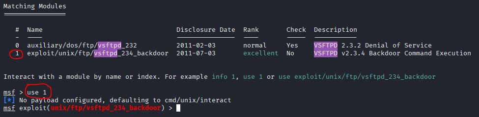

### Nyt katson, että mitä valintoja moduulissa on valmiina. 
Komento: show options

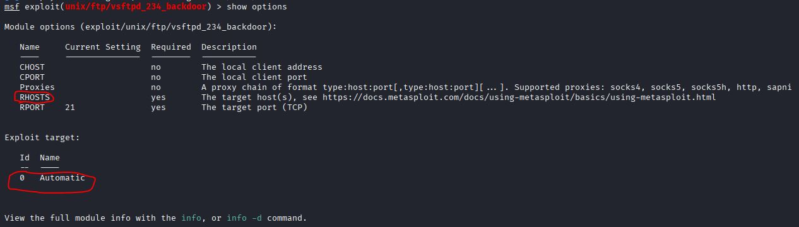

Moduulissa on automaattinen kohteen valinta. Se luultavasti hyökkää sitä ainoaa isäntää kohtaan, mikä on tallennettuna tietokantaan. Eli tässä tapauksessa kohdekone 192.168.56.103.

### Minä haluan varmuudella hyökkäyksen kohdekoneelle!
Asetan, RHOST: 192.168.56.103.
- Komento: set RHOST 192.168.56.103

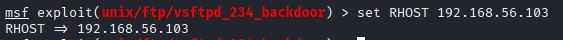

Ajan exploitin
- Komento: exploit

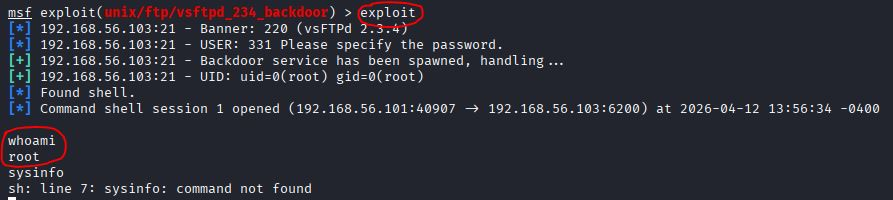

Sain tällä hyökkäyskoodilla root pääsyoikeudellisen komentorivin.


## g) Kerää levittäytymisessä (lateral movement) tarvittavaa tietoa metasploitablesta. Analysoi tiedot. Selitä, miten niitä voisi hyödyntää.

1. Kerään järjestelmästä tietoa, uname -a
2. Käyn katsomassa salasana-hash tiedoston sisällön: cat /etc/shadow
3. Tarkastelen muita tunnettuija koneita verkossa: arp -a
4. Tarkastelen reititystaulua: route

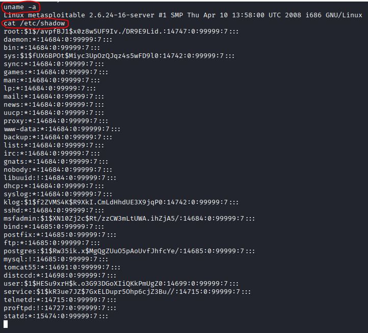

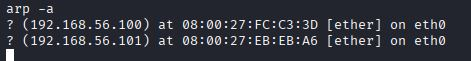

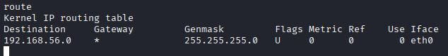

Näillä tiedoilla, voisin alkaa suunnittelemaan muille koneille levittäytymistä. Tiedän mitä osoitteita verkossa on. Voin alkaa yrittää palveluiden ja käyttäjien salasanojen murtamista.

## h) Murtaudu Metasploitableen jollain toisella tavalla. 
(Jos tämä kohta on vaikea, voit tarvittaessa turvautua verkosta löytyviin läpikävelyohjeisiin. Merkitse silloin raporttiin, missä määrin tarvitsit niitä).
### Kokeillaanpa jotain saatavilla olevaa palvelua, vaikka VNC portissa 5900.

Haetaan moduuli jolla hyväksikäyttää VNC-etäkäyttöä. Lisätään kohdekone.


Sitten vaan ajamaan exploit:

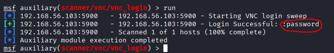

Salasana taitaa olla vain "password". Voidaan kokeilla sitä ja yrittää kirjautua VNCviewerillä sisään.

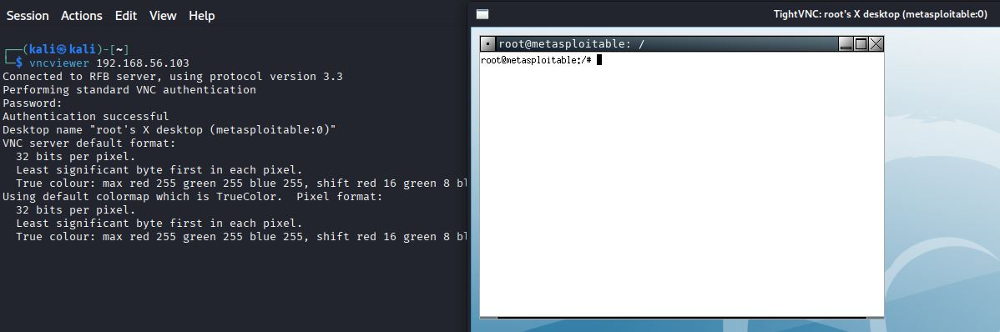

Sepäs meni näppärästi! Minulle aukesi jopa root-käyttäjän komentorivi.
[hackmd ericksanga](https://hackmd.io/@ericksanga/metasploitable2)

## i) Demonstroi Meterpretrin ominaisuuksia.

Yritin jonkin aikaa saada meterpreterin siirrettyä kohdekoneelle vsftpd yhteyden kautta, mutta onnistuin sulkemaan yhteyden. En halua yrittää sen uudelleen aukomista nyt.
Avaan SSH istunnon ja sen kautta laitan koneelle meterpreter ohjelman.

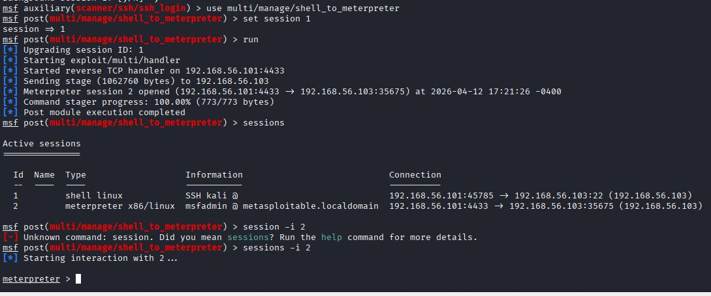

### Nyt on meterpreter paikallaan. Esitelläänpä sen ominaisuuksia
katsotaan järjestelmätiedot sysinfo
Katsotaan käyttäjä

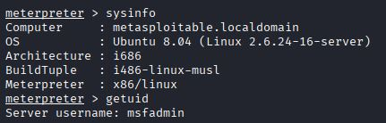

Käynnissä olevat prosessit

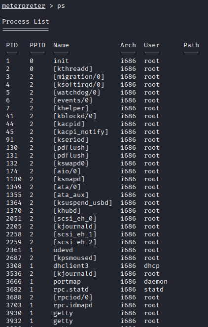

Verkkoasetukset:

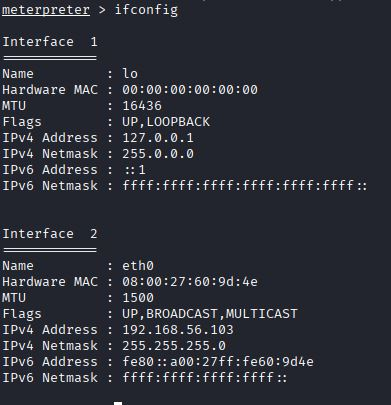


## j) Tallenna shell-sessio tekstitiedostoon script-työkalulla (script -fa log001.txt) tai tmux:lla.

## k) Pivot point. Laita kaikki harjoituksen tiedostot (script -fa, nmap -oA...) samaan kansioon. 
Hae sopiva pivot point (sovellus, versio, osoite, MAC-numero) 'grep -r' -komennolla. Keksi uskottava esimerkkikysymys, johon haet vastausta.


## l) Attaaack! Mitä Mitre Attack taktiikoita ja tekniikoita käytit tässä harjoituksessa? 
(Tässä alakohdassa "Attaack!" ei tarvitse tehdä lisää testejä koneella, koska testit on jo tehty.)


## m) Vapaaehtoinen: Etsi esimerkki Mitre Attack proseduurista (procedure), jossa joku uhkatoimija on käyttänyt samoja tekniikoita.
## n) Vapaaehtoinen: Titityy. Saatko Metasploitableen tty-shellin, eli esimerkiksi avattua koko ruudulle piirtävän nano:n?
## o) Vapaaehtoinen, vaikea: Kokeile jotain kilpailevaa hyökkäystyökalua tai vihamielistä etäkäyttötyökalua, kuten Sliver tai Scarecrow.
## p) Vapaaehtoinen: Asenna ja korkkaa Metasploitable 3. Karvinen 2018: Install Metasploitable 3 – Vulnerable Target Computer
## q) Vapaaehtoinen: Peekaboo. Demonstroi, kuinka hyökkääjä vakoilee meterpreterillä. 
Kuuntele mikrofonilla, ota kuvia tai videota kameralla. (Huolehdi, ettei ulkopuolisia joudu kuunnelluksi tai katselluksi.)

## Lähdeluettelo

- [Jaswal 2020: Mastering Metasploit - 4ed: Chapter 1: Approaching a Penetration Test Using Metasploit](https://learning.oreilly.com/library/view/mastering-metasploit/9781838980078/B15076_01_Final_ASB_ePub.xhtml#_idParaDest-31)(Luettu 9.4.2026)
- [nmap manual, host discovery](https://nmap.org/book/man-host-discovery.html) (Luettu 5.4.2026)
- [Gordon "Fyodor" Lyon, Nmap Network Scanning: The Official Nmap Project Guide to Network Discovery and Security Scanning, Chapter 3. Host Discovery (“Ping Scanning”): Disable Port Scan (-sn)](https://nmap.org/book/host-discovery-controls.html#host-discovery-sn) (Luettu 9.4.2026)
- [CVEdetails.com, Updated 2021: Vulnerability Details : CVE-2011-2523](https://www.cvedetails.com/cve/CVE-2011-2523/) (Luettu 12.4.26)
- 
