# h4 Täysin Laillinen Sertifikaatti
[Tero Karvinen 2026 late spring: Tunkeutumistestaus, Täysin Laillinen Sertifikaatti](https://terokarvinen.com/tunkeutumistestaus/)

## Ympäristö
- kali-linux-2025.4-virtualbox-amd64
  - Debian (64-bit)
  - 2048 MB base memory
  - 2 vCPU
  - NAT Network adapter
  - Host-only network adapter
  - Firefox 128.3.1esr (64-bit)
 
- Metasploitable 2
  - Oracle Linux (64-bit)
  - 2048 MB base memory
  - 1vCPU
  - Host-only network adapter
 
## x) Lue/katso ja tiivistä. 
> (Tässä x-alakohdassa ei tarvitse tehdä testejä tietokoneella, vain lukeminen tai kuunteleminen ja tiivistelmä riittää. 
> Tiivistämiseen riittää muutama ranskalainen viiva kustakin artikkelista - ei pitkiä esseitä. Kannattaa lisätä myös jokin oma ajatus, idea, huomio tai kysymys.)

### OWASP 2021: OWASP Top 10:2021
A01:2021 – Broken Access Control (IDOR ja path traversal ovat osa tätä)
 
  - "Access control", tarkoittaa ettei käyttäjät voi toimia valtuuksiensa ulkopuolella. Rikkinäinen "Access control" tarkoittaa, että käyttäjä pystyy toimimaan yli rajojensa.
    Tähän liittyy:
    - Muiden käyttäjien tilien hallinta ilman käyttöoikeustarkistusta.(IDOR, in direct object reference)
    - Pääsynhallinta tarkastuksien ohittaminen URL:ia muuttamalla.
    - Pääsytason korottaminen.
    - API kutsujen tekeminen ilman vaadittuja oikeuksia.
    - Cookies ja metadatan manipulointi.
  - Miten estetään?
    - Pääsynhallinta on turvallista vain palvelinpuolella suoritettavassa koodissa. Hyökkääjät eivät voi muuttaa sitä siellä.
  
Rikkinäisiä pääsynhallintoja on melko monenlaisia, mutta niitä tuntuu yhdistävän liiallinen luotto käyttäjiin. Jos käyttäjän syöte valitoidaan ennen käsittelyä, voidaan välttää suurinosa väärinkäytöstä.

### PortSwigget Academy:
  - [Insecure direct object references (IDOR)](https://portswigger.net/web-security/access-control/idor)
    - Nämä hyökkäykset onnistuu, kun käyttäjäsyöte saa käsitellä palvelimella sijaitsevia olioita suoraan. Esim. URL osoite, joka viittaa suoraan käyttäjätunnisteeseen on muokattavissa asiakaspäädyssä. Jos käyttäjää ei varmisteta, hyökkääjä voi liikkua sivuttaisesti muille käyttäjille tai jopa ylöspäin pääsyoikeuksissa.
  - [Path traversal](https://portswigger.net/web-security/file-path-traversal)
    -  Path Treversal on ilmiö jossa ulkoisesta syötteestä muodostetaan hakemistopolku, kun tehdään esimerkiksi HTTP-pyyntöjä sovellukselle.
    Tässä voidaan navigoida hakemistopolussa ylemmälle tasolle ilman vaadittavia oikeuksia.
  - [Cross-site scripting](https://portswigger.net/web-security/cross-site-scripting)
    - Hyökkäysmuoto jossa haavoittuvaan sovellukseen syötetään haitallista koodia, jota suoritetaan uhrin istunnossa. Kaapatussa istunnossa hyökkääjä voi saada sen vaikuttamaan siltä, että hänen toimet ovat uhrin suorittamia.
   

 
## a) Totally Legit Sertificate.
> Asenna OWASP ZAP, generoi CA-sertifikaatti ja asenna se selaimeesi.
> Laita ZAP proxyksi selaimeesi. Laita ZAP sieppaamaan myös kuvat, niitä tarvitaan tämän kerran kotitehtävissä.
> Osoita, että hakupyynnöt ilmestyvät ZAP:n käyttöliittymään.
> (Voi vaatia Firefox about:config network.proxy.allow_hijacking_localhost. Foxyproxy laittoi tämän aiemmin päälle itse.
> Kalin Firefox ESR oli viimeksi ongelmia Foxyproxyn kanssa - vaihtoehtona on asettaa Proxy käsin Settings, hakusana "proxy")

[zaproxy install guide for kali](https://www.kali.org/tools/zaproxy/)

### Latasin Zaproxyn

```
sudo apt install zaproxy
```
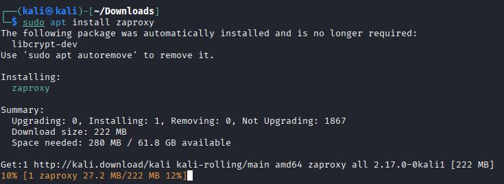

Sitten käynnistääkseni zaproxyn, kirjoitin komentoriville ja odottelin hieman:
```
zaproxy
```

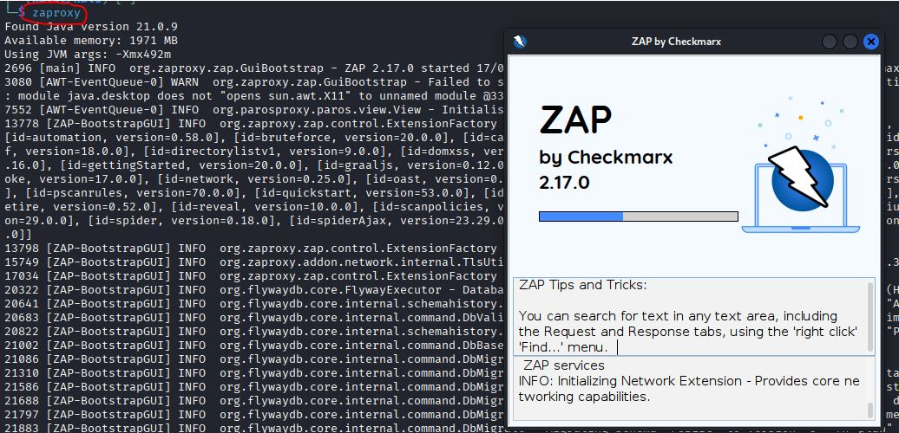

> Tässä näkyy myös Java versio: 21.0.9

Zap kysyy haluanko säilyttää istunnon. Haluan, joten täppä ekaan ruutuun: "YES, I WANT TO PERSIST THIS SESSION WITH NAME BASED ON THE CURRENT TIMESTAMP"

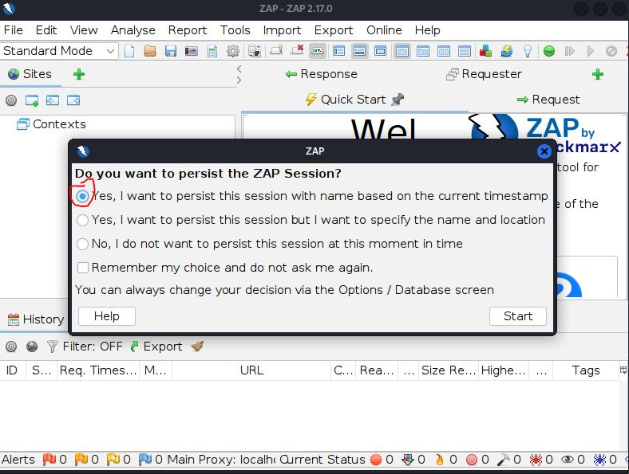

Tarkistin, että se tietää paikallisen palvelimen localhost:

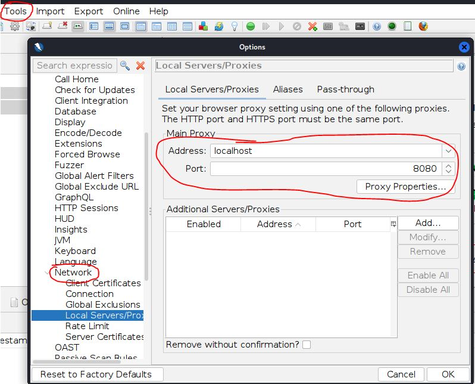

### Tein sertifikaatin sillä
Avasin "tools", sieltä "options", sitten "Network" ja vihdoinkin "server certificates". Se luo sertifikaatin ja minä vain tallennan sen. Painelen "save" ja valitsen minne tallennan.

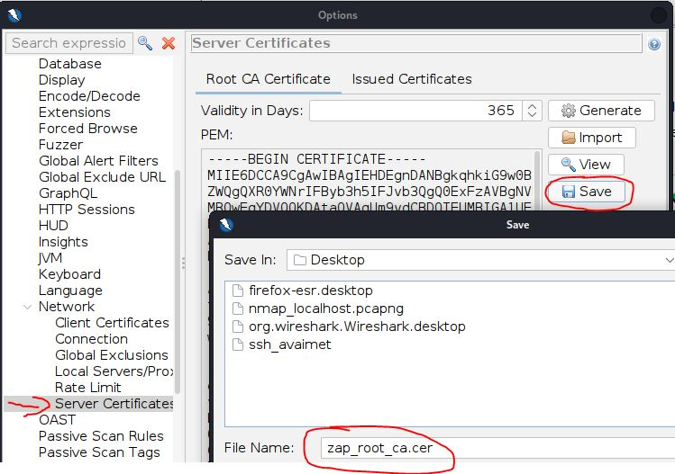


### Latasin sertifikaatin firefoxiin.
Firefoxin asetuksissa "Certificates" ja sieltä "view certificates". Sitten tuodaan sertifikaatti painamalla "import" ja valitsemalla tallennettu sertifikaatti. Firefox vielä kysyy, luotetaanko tähän sertifikaattiin verkkosivujen tunnistuksessa ja tähän vastaan kyllä.

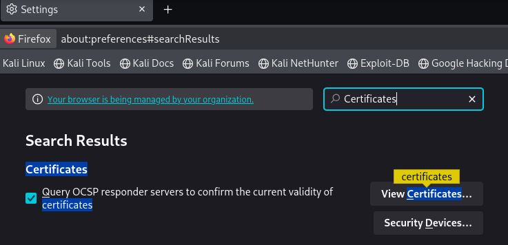

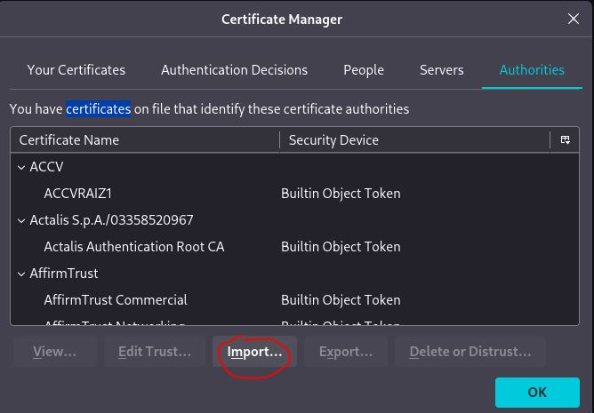

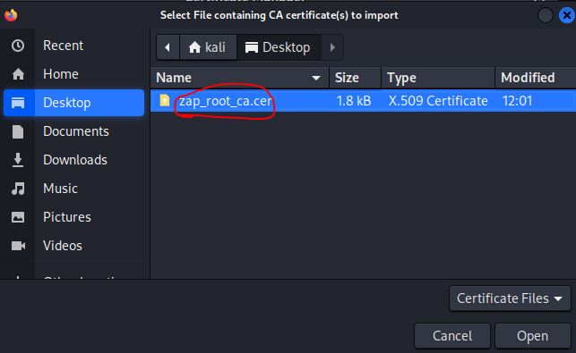

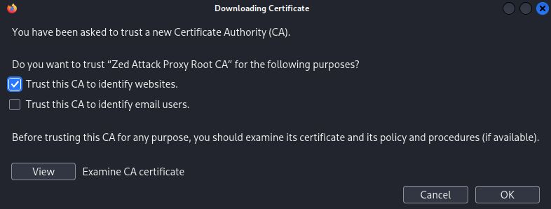

Nyt sertifikaatti on selaimeen tallennettu. Seuraavaksi testataan.

### Otin verkkoyhteyden pois testien ajaksi, koska haluan testata vain paikallisia web-palvelimiä nyt tässä vaiheessa.
Avasin manuaalisen tutkimisen ja yritin hakea http://example.com, joka ei tietenkään löytynyt ilman verkkoyhteyttä.

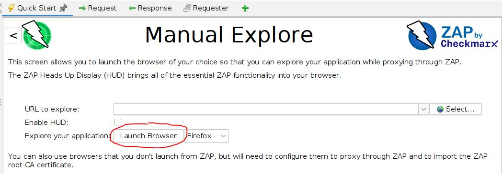

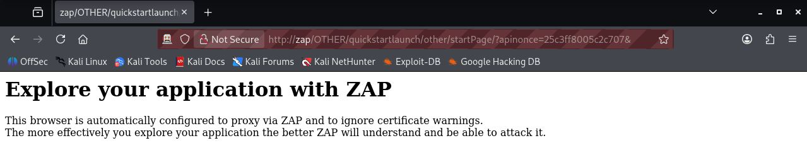

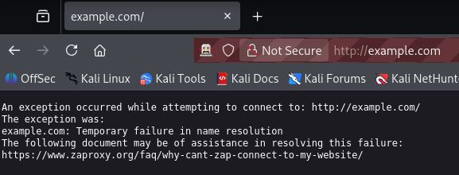

Tästä tuli tietysti GET-pyyntö näkyviin zapin historia paneeliin.

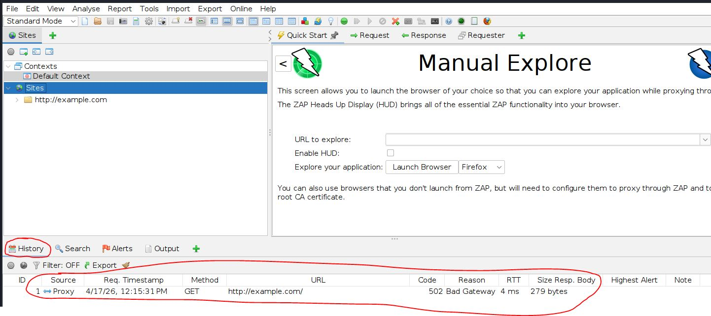

Yritin hakea paikallista webbipalvelinta, mutta sekään ei ensin tullut näkyviin, koska apache2 ei ollut käynnissä. Kävin potkaisemassa sen käyntiin ja sitten se tuli näkyviin. 

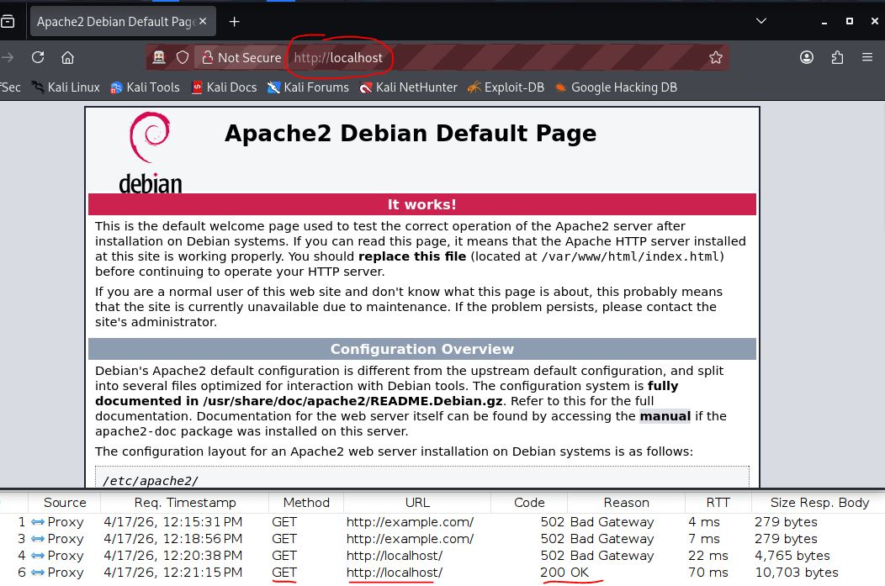

Nyt zap löytää apachen ja näyttää onnistuneen GET-pyynnön, jonka status on 200(OK).

### Pointti oli kuitenkin saada zaproxy nappaamaan selaimen http-pyynnöt ja siinä se onnistui jo ensimmäisellä. 
Mietin onko joitain riskejä, mitä olisi hyvä tiedostaa zaproxyn käytössä? Vastauksen löysin tältä sivulta: [zaproxy FAQ: is there any danger when scanning with zap against a live website](https://www.zaproxy.org/faq/is-there-any-danger-when-scanning-with-zap-against-a-live-website-e-g-create-delete-update-corrupt-data/). Perusasetuksilla(standard-mode) pelkkä selaaminen pitäisi olla ok, koska se EI pyri muuttamaan dataa ja lähettämään sitä takaisin palvelimelle. Zaproxy tekee passiivista skannausta, eli tutkii vain normaalia http-virtaa eikä lähetä paketteja palvelimelle.

### Kuva asetus
Jotta kuvat näkyisi http-pyynnöissä, laitoin seuraavan asetuksen päälle.
Tools -> options -> Display -> Process images in HTTP request/responses.

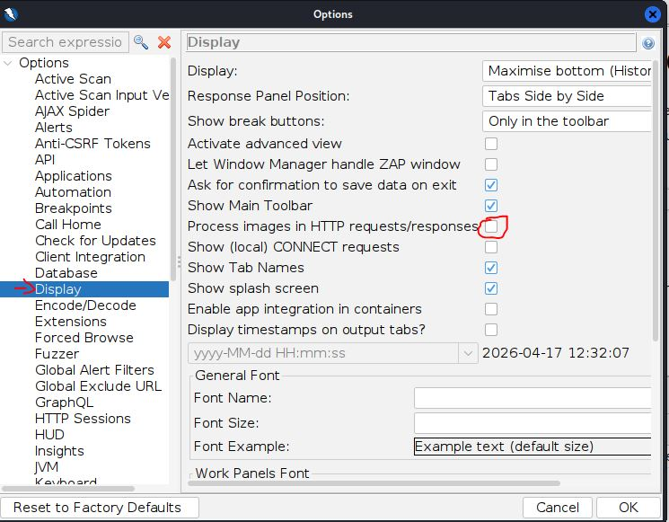

### Katsotaan löytyykö kuvia.
Laitoin verkkoyhteyden takaisin päälle. Kirjauduin portswiggeriin, avasin IDOR labran ja kopioin sen URL-osoitteen. Avasin manualiisen tarkasteulun zaproxyllä, syötin URL:in ja tarkastelin löytyykö kuvia sisältäviä http-pyyntöjä ja löytyyhän niitä.

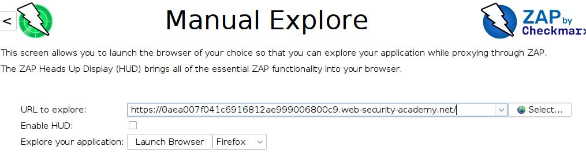

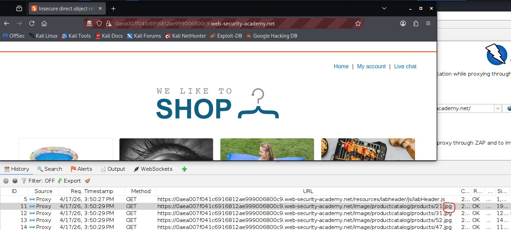

Kuva löytyy myös "Sites" sivupaneelissa.


En keksinyt miten kuvia voisi esikatsella zapissa, mutta en kylläkään tiedä voiko niin edes tehdä. Onko zapissa mahdollisuus katsoa niitä? Luulisin, että pystyy, koska zap näkee http-virran.

## b) Kettumaista.
> Asenna "FoxyProxy Standard" Firefox Addon, ja lisää ZAP proxyksi siihen.
> Käytä FoxyProxyn "Patterns" -toimintoa, niin että vain valitsemasi weppisivut ohjataan Proxyyn.
> (Läksyssä ohjataan varmaankin PortSwigger Labs ja localhost.)

> PortSwigger Labs. Ratkaise tehtävät. Selitä ratkaisusi: mitä palvelimella tapahtuu, mitä eri osat tekevät, miten hyökkäys löytyi, mistä vika johtuu. 
> Kannattaa käyttää ZAPia, vaikka malliratkaisut käyttävät harjoitusten tekijän maksullista ohjelmaa. Monet tehtävät voi ratkaista myös pelkällä selaimella. 
> Malliratkaisun kopioiminen ZAP:n tai selaimeen ei ole vastaus tehtävään, vaan ratkaisu ja haavoittuvuuden etsiminen on selitettävä ja perusteltava.
> Cross Site Scripting (XSS)
  > - c) Reflected XSS into HTML context with nothing encoded
  > - d) Stored XSS into HTML context with nothing encoded
  > - e) Selitä esimerkin avulla, mitä hyökkääjä hyötyy XSS-hyökkäyksestä. Alert("Hei Tero!") ei vielä tarjoa kummoista pääsyä. (Tässä alakohdassa ei tarvitse tehdä testejä tietokoneella, pelkkä lyhyt ja selkeä selitys riittää.)
> Path traversal
  > - f) File path traversal, simple case. Laita tarvittaessa Zapissa kuvien sieppaus päälle.
  > - g) File path traversal, traversal sequences blocked with absolute path bypass
  > - h) File path traversal, traversal sequences stripped non-recursively
> Insecure Direct Object Reference (IDOR)
  > - i) Insecure direct object references


## Lähdeluettelo:
- Tero Karvinen 2026 late spring: Tunkeutumistestaus, Täysin Laillinen Sertifikaatti (https://terokarvinen.com/tunkeutumistestaus/) (Luettu 17.4.2026)
- A01:2021 – Broken Access Control (https://owasp.org/Top10/2021/A01_2021-Broken_Access_Control/index.html) (Luettu 17.4.2026)
-  MITRE: CWE-35 Path Traversal: '.../...//' (4.19.1) (https://cwe.mitre.org/data/definitions/35.html) (Luettu 17.4.2026)
-  PortSwigget Academy: Insecure direct object references (IDOR)(https://portswigger.net/web-security/access-control/idor) (Luettu 17.4.2026)
-  PortSwigget Academy: Path traversal(https://portswigger.net/web-security/file-path-traversal) (Luettu 17.4.2026)
-  PortSwigget Academy: Cross-site scripting (https://portswigger.net/web-security/cross-site-scripting) (Luettu 17.4.2026)
-  Kali.org: zaproxy install guide for kali (https://www.kali.org/tools/zaproxy/)
-  Zaproxy FAQ: is there any danger when scanning with zap against a live website (https://www.zaproxy.org/faq/is-there-any-danger-when-scanning-with-zap-against-a-live-website-e-g-create-delete-update-corrupt-data/)


